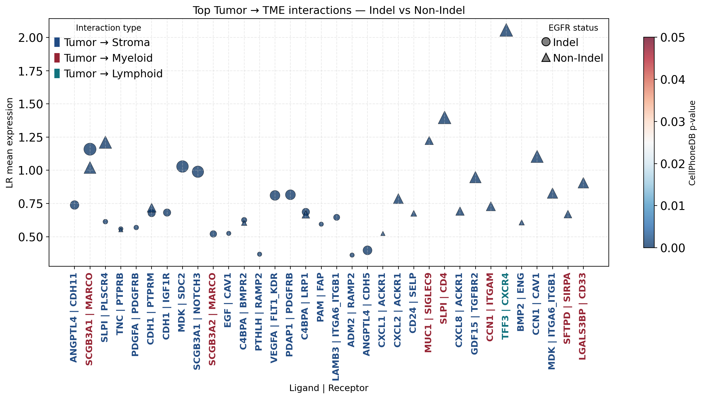
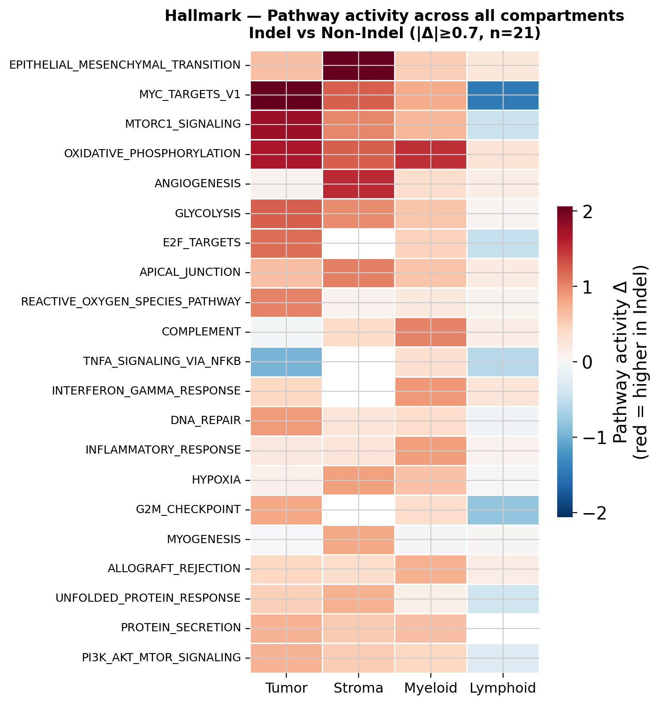

<!-- top-right float -->


# Tumor Microenvironment Interactions in scRNA-seq of LUAD

Single-cell transcriptomic analysis of tumor microenvironment in lung adenocarcinoma stratified by EGFR mutational status (indel vs. non-indel).

---

## Goals and Objectives

**Goal:** Characterize TME interactions in LUAD across compartments stratified by EGFR mutational status using scRNA-seq data.

**Objectives:**
1. Perform QC and preprocessing of scRNA-seq data (Lee et al. dataset)[1].
2. Attempt TCGA Wilkerson TRU subtype[2] classification via XGBoost[3] trained on bulk RNA-seq reference data and hierarchical clustering.
3. Stratify patients by EGFR mutational status (indel vs. non-indel)
4. Perform differential expression via pseudobulk with DESeq2[4].
5. Analyze cell-cell communication (tumor → TME) using LIANA+[5].
6. Perform pathway activity analysis across all TME compartments (Hallmark collection) using decoupleR[6].

---

## Repository Structure

```
.
├── data/
│   ├── cellxgene.h5ad                             # Raw scRNA-seq (Lee et al.), input for QC, not in repo due to git memory limit
│   ├── adata_qc.h5ad                              # QC-filtered data (generated by thesis_qc.ipynb), not in repo due to git memory limit
│   ├── TCGA-LUAD.star_counts.tsv.gz               # TCGA bulk RNA-seq counts
│   ├── 41586_2014_BFnature13385_MOESM21_ESM.xlsx  # TCGA sample metadata with expression subtypes
│   ├── hvg_sc_lee_et_al_gene_list.txt             # HVG gene list from Lee et al. scRNA-seq
│   ├── genes_to_keep.txt                          # Tumor-specific gene filter
│   ├── genes_filtered_with_recount.txt            # Genes retained after recount3 cross-reference filter
│   ├── for_gepia2.txt                             # Gene list exported from .R script
│   ├── luad_subtype_predictions.csv               # Per-cell TRU/NON-TRU predictions from XGBoost
│   ├── pseudobulk_donors_lee.csv                  # Pseudobulk expression matrix aggregated per donor
│   ├── hclust_donors_results.csv                  # Hierarchical clustering results per donor
│   ├── hclust_linkage_Z.npy                       # Linkage matrix from hierarchical clustering
│   ├── hallmark.csv                               # MSigDB Hallmark gene sets (geneset, genesymbol)
│   └── reactome.csv                               # Reactome gene sets (geneset, genesymbol)
│
├── models/
│   ├── xgb_luad_final_BIN.pkl                  # Final XGBoost TRU/NON-TRU classifier
│   ├── xgb_luad_boosted.pkl                    # XGBoost with boosted IFN features
│   ├── label_encoder_BIN.pkl                   # Label encoder (TRU / NON-TRU)
│   └── supplementary/
│       ├── genes_final_BIN.npy                 # Final feature gene set
│       ├── hvg_bulk_BIN.npy                    # HVG from bulk RNA-seq
│       ├── hvg_sc_BIN.npy                      # HVG from scRNA-seq
│       ├── hvg_common_BIN.npy                  # Intersection of bulk and sc HVGs
│       ├── shap_importance_final_BIN.csv       # SHAP feature importances
│       └── elimination_log_BIN.csv             # Iterative SHAP elimination log
│
├── notebooks/
│   ├── thesis_qc.ipynb                         # [1] QC, filtering, normalization
│   ├── luad_classifier_full_binary.ipynb       # [2] XGBoost TRU classifier (bulk training)
│   ├── thesis_tru_xgb.ipynb                    # [3] Classifier inference on scRNA-seq
│   ├── thesis_hierarch_clustering.ipynb        # [4] Hierarchical + Leiden clustering of tumor cells
│   └── thesis_egfr_bin.ipynb                   # [5] DESeq2, LIANA+, decoupleR (EGFR indel vs. non-indel)
│
├── scripts/
│   └── commongenes.R                           # R script: intersect bulk and sc HVGs for classifier features
│
└── figures/                                    # All output figures (generated on notebook run)
```

**Execution order:** `thesis_qc` → `luad_classifier_full_binary` → `thesis_tru_xgb` → `thesis_hierarch_clustering` → `thesis_egfr_bin`

`adata_qc.h5ad` is required by notebooks 3–5 and is generated by notebook 1.

---

## Requirements

```
python>=3.9
scanpy
scrublet
harmonypy
decoupler
liana
pertpy
pydeseq2
xgboost
shap
joblib
scikit-learn
pandas
numpy
matplotlib
seaborn
scipy
statsmodels
mygene
```

Install:
```bash
pip install scanpy scrublet harmonypy decoupler liana pertpy pydeseq2 xgboost shap joblib scikit-learn pandas numpy matplotlib seaborn scipy statsmodels mygene
```

---

## Results

### TRU Subtype Classification

A binary XGBoost classifier (TRU vs. NON-TRU) was trained on TCGA bulk RNA-seq data using iterative SHAP feature elimination to select tumor-specific genes shared between bulk and scRNA-seq HVGs. The classifier achieved satisfactory performance on held-out bulk data; however, direct transfer to scRNA-seq did not yield reliable predictions, likely due to technical modality differences.

| Figure | Description |
|--------|-------------|
| `figures/cv_results.png` | ROC-AUC and confusion matrix — 5-fold CV on bulk training data |
| `figures/shap_elimination_curve.png` | CV accuracy across SHAP iterative feature elimination |
| `figures/shap_top30.png` | Top 30 features by mean absolute SHAP value |
| `figures/test_results.png` | ROC-AUC and confusion matrix — held-out test set |

### Tumor Cell Clustering

Tumor cells were subjected to hierarchical (pseudobulk, correlation distance) and Leiden clustering with Harmony batch correction across donors.

| Figure | Description |
|--------|-------------|
| `figures/hclust_donors.png` | Hierarchical clustering dendrogram of donors (pseudobulk, top-2000 HVG) |
| `figures/umap_tumor_clusters.png` | UMAP of tumor cells colored by Leiden cluster |
| `figures/umap_tumor_donors.png` | UMAP of tumor cells colored by donor |
| `figures/umap_harmony_clusters.png` | UMAP after Harmony batch correction — Leiden clusters |
| `figures/umap_harmony_donors.png` | UMAP after Harmony batch correction — donor distribution |

### Differential Expression (Indel vs. Non-Indel EGFR)

Pseudobulk DESeq2 was applied per compartment (Myeloid, Lymphoid, Stroma). Significant differences were largely confined to the stromal compartment (34 DEGs, padj < 0.05, |log2FC| > 1).

| Figure | Description |
|--------|-------------|
| `figures/volcano_combined_indel_vs_nonindel.png` | Combined volcano plot across all compartments |

Full gene tables: `figures/deseq2_indel_vs_nonindel_summary.txt`

### Cell-Cell Communication (LIANA+)

Tumor-to-TME interactions were ranked via LIANA+ rank aggregate. Indel tumors were dominated by tumor-stroma interactions consistent with stromal activation and angiogenesis; non-indel tumors showed an immune-evasion-oriented profile.

| Figure | Description |
|--------|-------------|
| `figures/liana_top_tumor_to_tme_combined_egfr_bin.png` | Top Tumor→TME interactions (top-20 per group, colored by target compartment) |

<p align="center">
  
</p>
### Pathway Activity (decoupleR ULM)

Pathway activity scores (Hallmark and Reactome) were computed per cell and compared between EGFR groups using Mann-Whitney U with FDR correction.

| Figure | Description |
|--------|-------------|
| `figures/pathway_heatmap_Hallmark_all_compartments_egfr_bin.png` | Hallmark pathway activity delta heatmap across compartments |
| `figures/pathway_heatmap_Reactome_all_compartments_egfr_bin.png` | Reactome pathway activity delta heatmap across compartments |

#### Hallmark Pathway Activity (decoupleR ULM)

<p align="center">
  
</p>

---

## Conclusions

- Indel-EGFR-mutant tumors exhibit a coordinated upregulation of proliferative, metabolic, and DNA repair programs accompanied by apoptosis suppression — consistent with an aggressive tumor phenotype.
- The stromal compartment shows the strongest response: EMT and angiogenesis are strongly upregulated in indel patients, pointing to extracellular matrix remodeling and a pro-angiogenic architecture.
- Myeloid compartment in indel patients shows inflammatory and metabolic activation with interferon response suppression.
- Lymphoid compartment shows suppression of proliferative and metabolic programs in indel patients.
- EGFR mutational status (indel vs. non-indel) modulates the composition of tumor-microenvironment crosstalk rather than its existence — core stromal interactions are preserved across both groups.
- The main limitation is a small cohort (15 patients); results should be considered preliminary and require validation on independent datasets.

---

## References

1. Lee, J., Jeong, J. Y., Hong, M. J., et al. (2026). Defining the cellular and molecular identities of histologic subtypes in lung adenocarcinoma. Experimental Hematology & Oncology, 15, 12. https://doi.org/10.1186/s40164-025-00740-6 
2. Wilkerson, M. D., Yin, X., Walter, V., et al. (2012). Differential pathogenesis of lung adenocarcinoma subtypes involving sequence mutations, copy number, chromosomal instability, and methylation. PLoS ONE, 7(5), e36530. https://doi.org/10.1371/journal.pone.0036530
3. Chen, T., He, T., Benesty, M., et al. (2026). xgboost: Extreme gradient boosting (Version 3.3.0.0) [R package]. GitHub. https://github.com/dmlc/xgboost 
4. Muzellec, B., Teleńczuk, M., Cabeli, V., et al. (2023). PyDESeq2: A Python package for bulk RNA-seq differential expression analysis. Bioinformatics, 39(9), btad547. https://doi.org/10.1093/bioinformatics/btad547 
5. Dimitrov, D., Türei, D., Garrido-Rodriguez, M., et al. (2022). Comparison of methods and resources for cell-cell communication inference from single-cell RNA-seq data. Nature Communications, 13, 3224.
6. Badia-i-Mompel, P., Vélez Santiago, J., Braunger, et al. (2022). decoupleR: Ensemble of computational methods to infer biological activities from omics data. Bioinformatics Advances. https://doi.org/10.1093/bioadv/vbac016 

